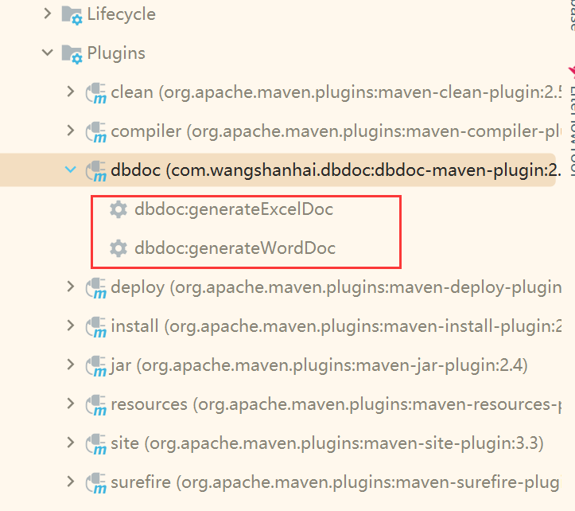
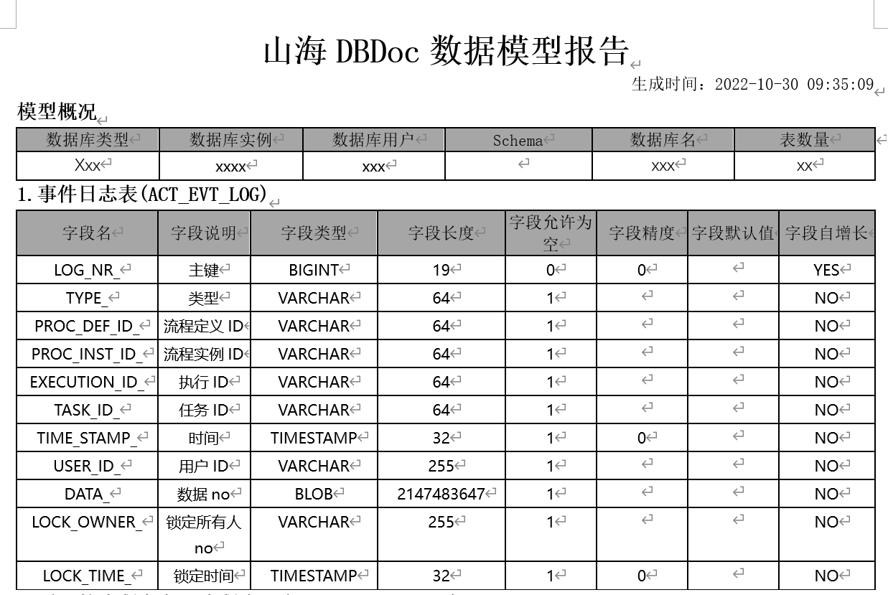

<div align="center">
  <p>
    
  </p>
  <p>山海DBDoc-数据库模型文档生成利器（支持国产信创）</p>
  <p>ShanHaiDBDoc-A Swiss Army Knife for generating data model documents (supports exporting Word/Excel)
  <p>
    <a href="https://github.com/SeeMountainSea/shanhai-dbdoc-maven-plugin/releases/latest"></a>
    <a href="https://github.com/SeeMountainSea/shanhai-dbdoc-maven-plugin/issues"></a>
    <a href="https://github.com/topics/java"></a>
    <br>
    <a href="https://github.com/SeeMountainSea/shanhai-dbdoc-maven-plugin/find/master"></a>
    <a href="https://github.com/SeeMountainSea/shanhai-dbdoc-maven-plugin/find/master"></a>
    <a href="https://github.com/SeeMountainSea/shanhai-dbdoc-maven-plugin/blob/master/LICENSE"></a>
  </p>
</div>


ShanHaiDBDoc 主要提供以下能力：

- 支持全类型数据库导出Word版本数据模型文档
- 支持全类型数据库导出Excel版本数据模型文档
- 原生支持国产信创数据库（只要你有数据库驱动，理论上兼容后续各类数据库）
- 导出模型文档时建议使用单库进行（例如oracle）
- 如果有更多Ideal,欢迎大家提PR

## 1.引入插件

```xml
    <build>
        <plugins>
            <plugin>
                <groupId>com.wangshanhai.dbdoc</groupId>
                <artifactId>dbdoc-maven-plugin</artifactId>
                <version>1.0.1</version>
                <configuration>
                    <jdbcUrl>xxx</jdbcUrl><!--自己项目配置的JDBC URL-->
                    <user>xxx</user> <!--数据库用户名-->
                    <password>xxx</password> <!--数据库密码-->
                    <driver>xxxx</driver><!--数据库驱动定义-->
                    <driverFilePath>/db/mysql.jar</driverFilePath><!--数据库驱动文件位置-->
                    <outPath>/db/doc/</outPath><!--数据模型导出目录-->
                </configuration>
            </plugin>
        </plugins>
    </build>
```


## 2.数据模型导出

如下图所示：
<div align="left">
  <p>
   
  </p>
</div>


## 3.数据模型导出预览
Word如下图所示：
<div align="left">
  <p>
   
  </p>
</div>
Excel如下图所示：
<div align="left">
  <p>
   
  </p>
</div>


